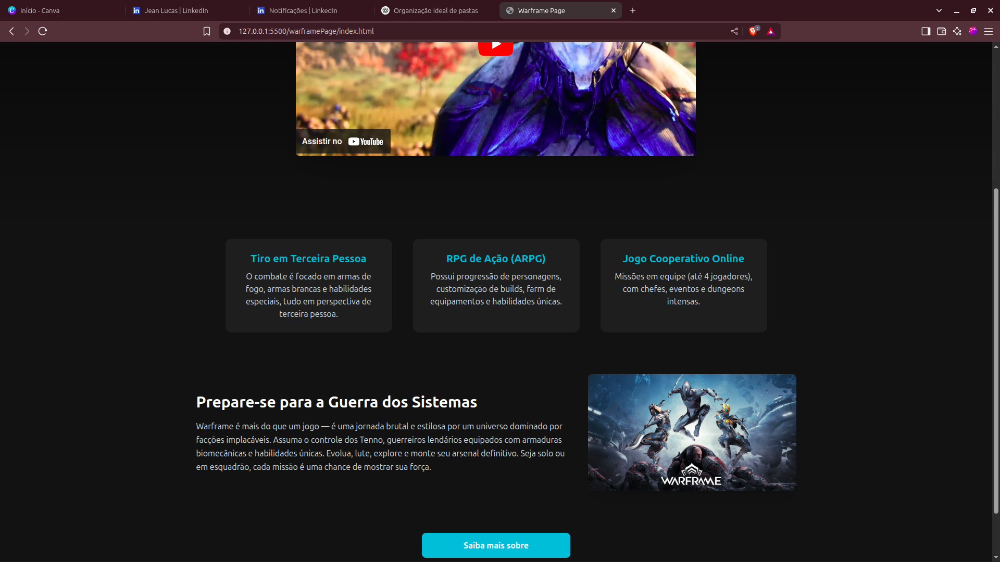

# Warframe Page

Projeto com duas páginas temáticas do jogo **Warframe**, desenvolvidas para fins de estudo:

- Página inicial utilizando **Tailwind CSS**
- Página sobre utilizando **CSS tradicional**

## Sobre o Projeto

Este projeto tem como objetivo praticar diferentes abordagens de estilização web, aplicadas a páginas distintas dentro do mesmo site. A página inicial foi criada com Tailwind CSS, enquanto a página sobre foi estilizada com CSS tradicional.

## Tecnologias Utilizadas

- HTML5
- Tailwind CSS (para a página inicial)
- CSS tradicional (para a página sobre)

## 🖼️ Capturas de Tela

### Pagina inicial

### Pagina Sobre

